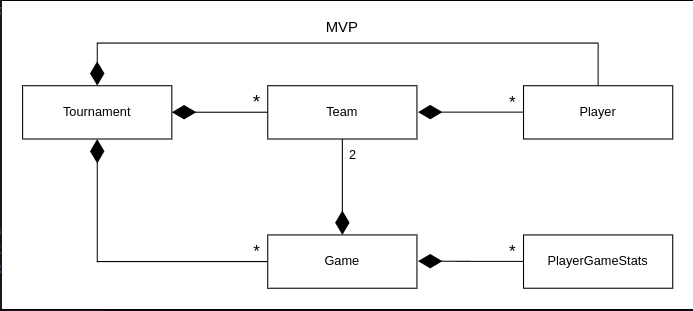

# Basketball Tournament Analysis
This project aims to analyze a basketball tournament by evaluating team and player performances using Java.

---

## Objectives
- Understand fundamental concepts of object-oriented programming in Java.
- Design and implement classes to represent entities and their relationships.
- Gain skills in organizing and processing data.
- Enhance coding skills and develop algorithmic reasoning.
- Apply learned concepts to real-world scenarios.
- Construct sizable projects and improve problem-solving capabilities through an incremental approach.

---

## Project requirements
The project is designed to achieve the following objectives in analyzing the performance of teams and players:

- **Individual player scores:** Calculate individual player scores for each game based on performance metrics such as points scored, rebounds, and assists.

- **Team scores:** Compute the total score for each game to enable comparison of team performance.

- **Game summaries:** Generate detailed summaries for each game, including information about the participating teams, scores, attendance, and other relevant metrics.

- **Highest scorers:**
    - Identify the highest scorer from each team in every game.
    - Determine the highest scorer across the entire tournament.

- **MVP statistics:** Calculate comprehensive statistics for the most valuable player (MVP), including total games played, total points scored, rebounds, and assists.

---

## Class structure
- Tournament
- Team
- Player
- Game
- PlayerGameStats

---

## Relationships in the UML diagram

- `Tournament`-`Player`: There exists a one-to-one relationship between `Tournament` and the MVP, indicating that each tournament corresponds to a single MVP.

- `Tournament`-`Team`: A one-to-many relationship exists between the `Tournament` and `Team` classes, signifying that a tournament encompasses multiple teams. In our specific case, there are only two teams.

- `Tournament`-`Game`: A one-to-many relationship exists between the `Tournament` and `Game` classes, indicating that a tournament consists of multiple games.

- `Game`-`Team`: A one-to-two relationship exists between the `Game` and `Team`, implying that each game involves two teams.

- `Game`-`PlayerGameStats`: A one-to-many relationship exists between the `Game` and `PlayerGameStats` classes, suggesting that each game records statistics for multiple players.

---
